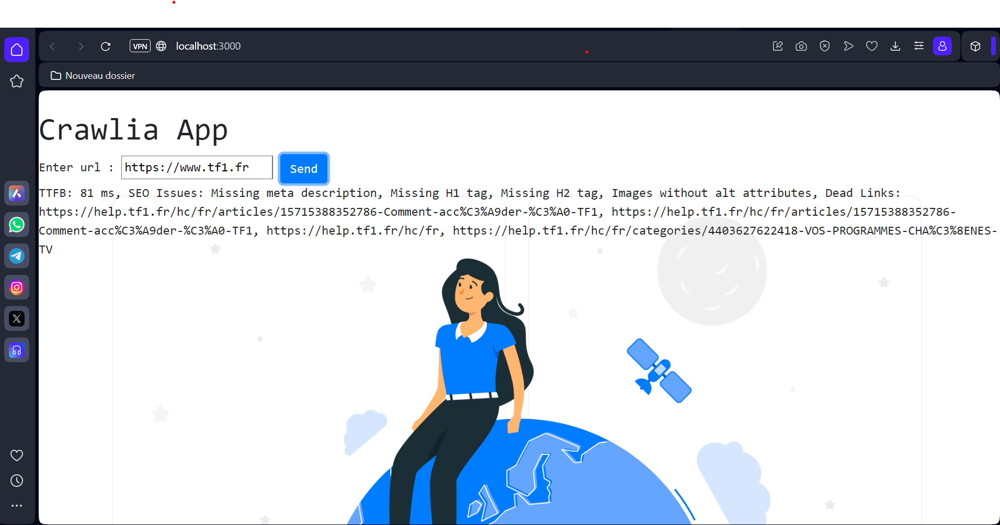

# Crawlia

This is a simple web scrapping app made in Node.js.
The user interface contain just a simple input containing the URL you want to analyze.
Once the form submitted, the analysis starts.
Once the report generated,  it presents  to the user !

## Analysing the page

crawlia analyse : 

```text
- TTFB ( response time from the server in ms ).
- Does the document has SEO attribute such as meta-description, h1, h2 etc… ?
- Does the page include deadlinks ? ( 404 urls in the page for example ).
```
### Exemple




## How to execute the code 

Initialize the Project:
```
npm init -y
```

Install dependencies :
```
npm install express 
```

Launch Application :
```
node app.js
```

Open your browser and go to :
```
http://localhost:3000
```
Enter a URL to analyze and view the results.


