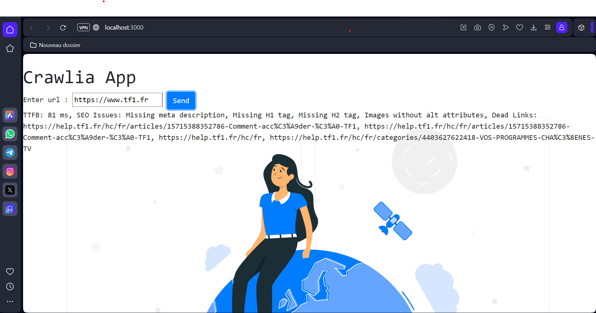

# Crawlia

This is a simple web scrapping app made in node js.
The user interface contain just a simple input containing the URL you want to analyze.
Once the form submitted, the analyse starts.
Once the report generated,  it present  to the user !

## Analysing the page

crawlia analyse : 

```text
- TTFB ( response time from the server in ms ).
- Does the document has SEO attribute such as meta-description, h1, h2 etc… ?
- Does the page include deadlinks ? ( 404 urls in the page for example ).
```
### Exemple

